---
## Author
author:
  name: Байрамов Исмаил Мухандис оглы
  email: 1032253514@pfur.ru

## Title
title: "Отчёта по лабораторной работе №7. Команды безусловного и условного переходов в Nasm. Программирование ветвлений."
number-sections: true
license: "CC BY"
---

# Цель работы

Изучение команд условного и безусловного переходов. Приобретение навыков написания программ с использованием переходов. Знакомство с назначением и структурой файла листинга.


# Выполнение лабораторной работы

1. Создадим каталог для программ лабораторной работы № 7, перейдем в него и создадим файл `lab7-1.asm` (рис. @fig-001).

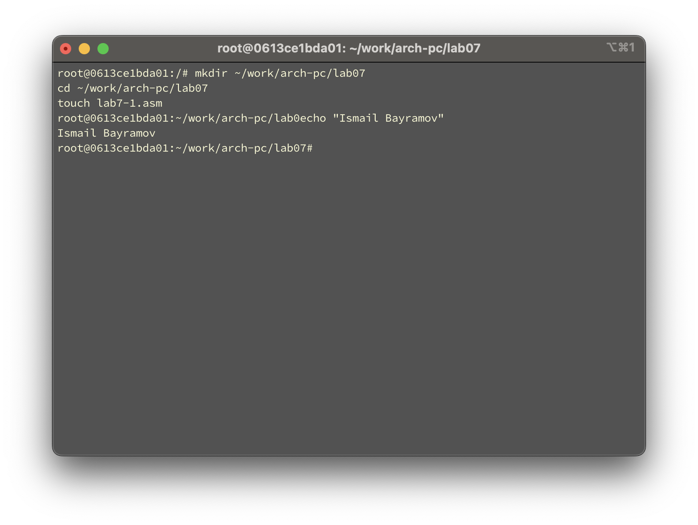{#fig-001 width=70%}

2. Инструкция `jmp` в NASM используется для реализации безусловных переходов. Рассмотрим пример программы с использованием инструкции jmp. Введем в файл `lab7-1.asm` текст программы из листинга 7.1 (рис. @fig-002). 

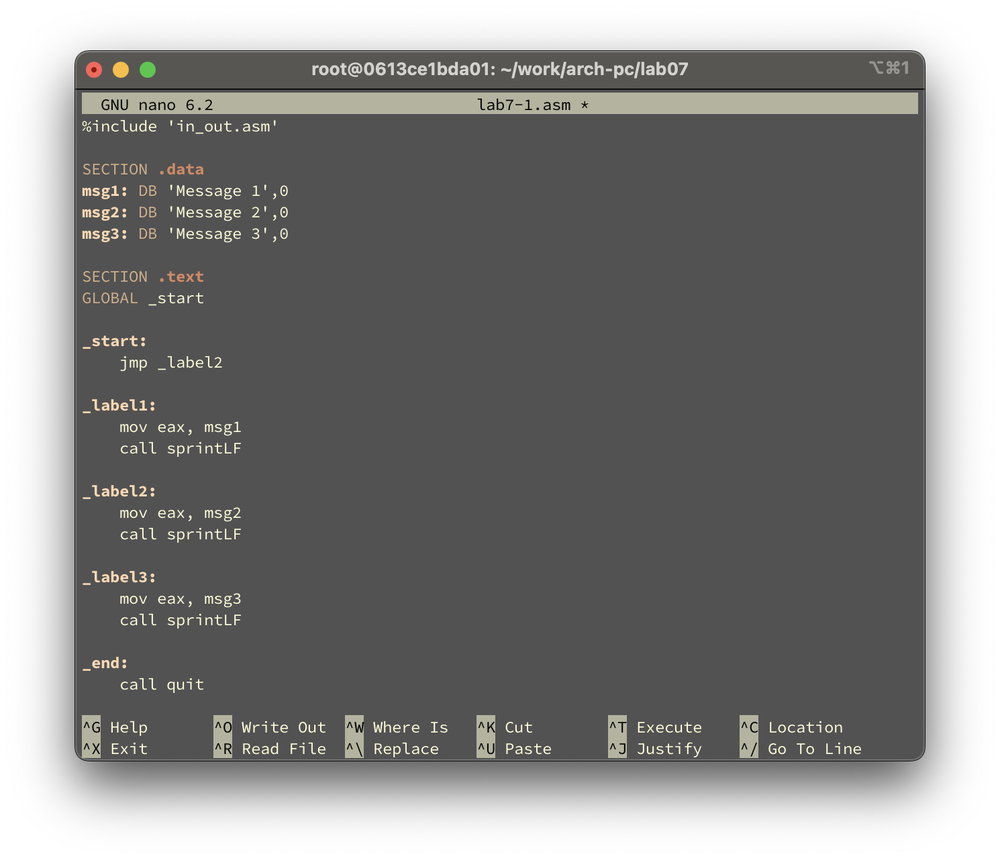{#fig-002 width=70%}

Создадим исполняемый файл и запустим его. Результат работы данной программы будет
следующим: 

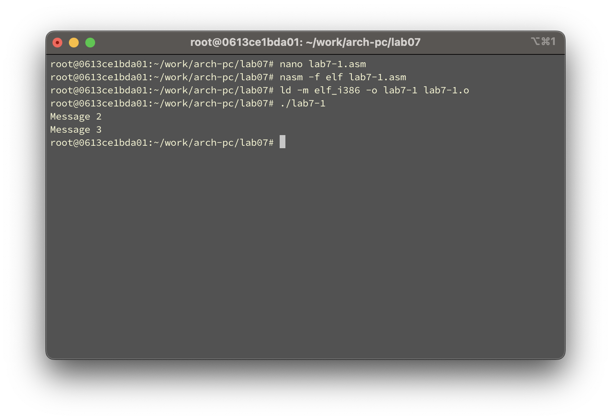{#fig-003 width=70%}

Таким образом, использование инструкции `jmp _label2` меняет порядок исполнения инструкций и позволяет выполнить инструкции начиная с метки `_label2`, пропустив вывод первого сообщения.

Инструкция `jmp` позволяет осуществлять переходы не только вперед но и назад. Изменим программу таким образом, чтобы она выводила сначала `‘Сообщение № 2’`, потом `‘Сообщение № 1’` и завершала работу. Для этого в текст программы после вывода сообщения № 2 добавим инструкцию `jmp` с меткой `_label1` и после вывода сообщения № 1 добавим инструкцию `jmp` с меткой `_end`. Измените текст программы в соответствии с листингом 7.2 (рис. @fig-004).

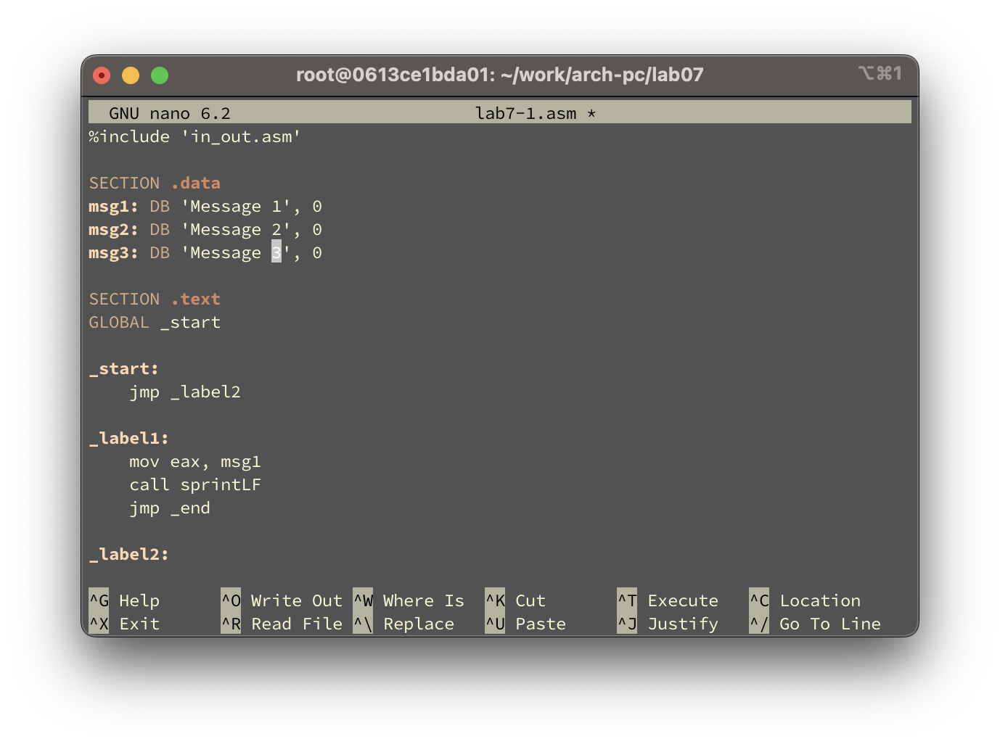{#fig-004 width=70%}

{#fig-005 width=70%}

Изменим текст программы, изменив инструкции jmp, чтобы вывод программы был следующим: (см. рис. @fig-006)

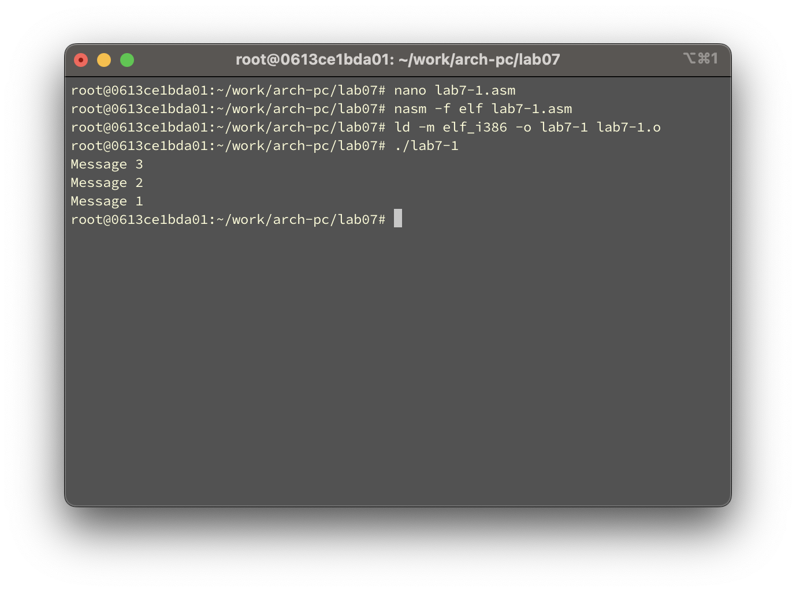{#fig-006 width=70%}

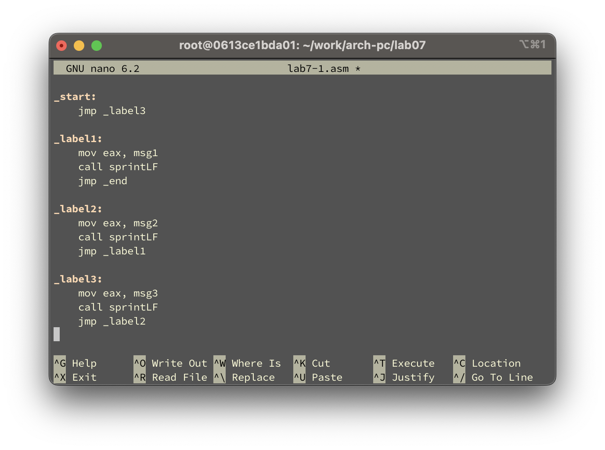{#fig-007 width=70%}

3. Использование инструкции `jmp` приводит к переходу в любом случае. Однако, часто при написании программ необходимо использовать условные переходы, т.е. переход должен происходить если выполнено какое-либо условие. В качестве примера рассмотрим программу, которая определяет и выводит на экран наибольшую из 3 целочисленных переменных: A, B и C. Значения для A и C задаются в программе, значение B вводиться с клавиатуры.

Создадим файл lab7-2.asm в каталоге `~/work/arch-pc/lab07`. Внимательно изучим текст
программы из листинга 7.3 и введем в `lab7-2.asm` (рис. @fig-008).

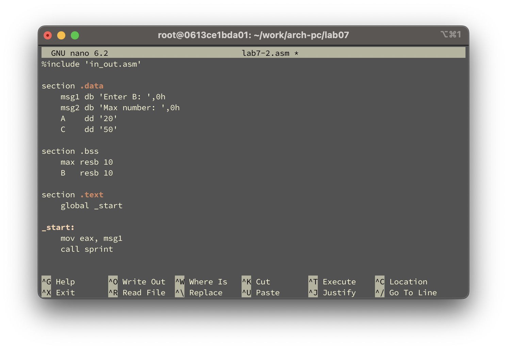{#fig-008 width=70%}

Создадим исполняемый файл и проверим его работу для разных значений B (рис. @fig-009).

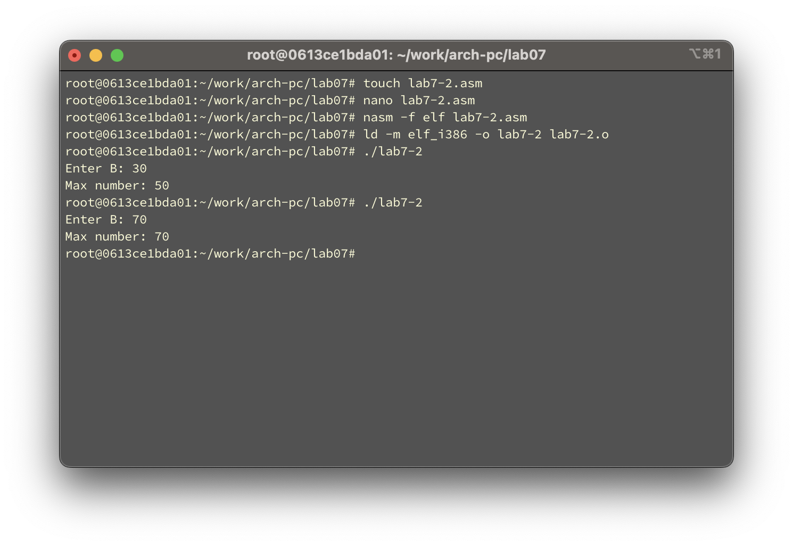{#fig-009 width=70%}

Обратим внимание, что в данном примере переменные A и С сравниваются как символы, а переменная B и максимум из A и С как числа (для этого используется функция `atoi` преобразования символа в число). Это сделано для демонстрации того, как сравниваются данные. Данную программу можно упростить и сравнивать все 3 переменные как символы (т.е. не использовать функцию `atoi`). Однако если переменные преобразовать из символов числа, над ними можно корректно проводить арифметические операции.

4. Обычно `nasm` создаёт в результате ассемблирования только объектный файл. Получить файл листинга можно, указав ключ `-l` и задав имя файла листинга в командной строке.
Создадим файл листинга для программы из файла `lab7-2.asm` и откроем файл листинга `lab7-2.lst` с помощью текстового редактора `mcedit` (рис. @fig-010).

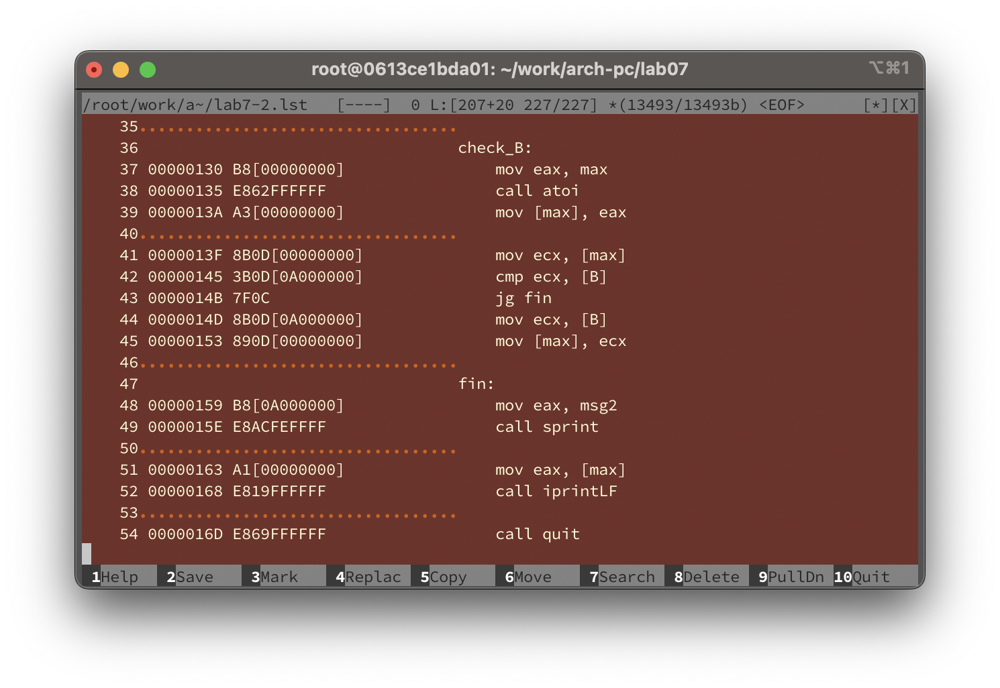{#fig-010 width=70%}

Внимательно ознакомимся с его форматом и содержимым. Объясним содержимое трёх строк файла листинга по выбору:

Рассмотрим строки:

```

41 0000013F 8B0D[00000000]   mov ecx, [max]
42 00000145 3B0D[A0000000]   cmp ecx, [B]
43 0000014B 7F0C             jg  fin

```
### Строка 41

```

41 0000013F 8B0D[00000000]   mov ecx, [max]

```

- `41` — 41-я строка листинга.
- `0000013F` — по этому адресу в коде лежит инструкция `mov ecx, [max]`.
- `8B0D[00000000]` — машинный код:
  - `8B` — команда `MOV r32, r/m32`;
  - `0D` + смещение `[00000000]` — способ указать адрес переменной `max`.

Смысл команды: загрузить значение из переменной `max` в регистр `ECX`.

### Строка 42

```

42 00000145 3B0D[A0000000]   cmp ecx, [B]

```

- `42` — номер строки.
- `00000145` — адрес этой команды.
- `3B0D[A0000000]` — машинный код сравнения:
  - `3B` — команда `CMP r32, r/m32`;
  - `0D` + смещение `[A0000000]` — указание адреса переменной `B`.

Смысл команды: сравнить значение в `ECX` с содержимым переменной `B`.

### Строка 43

```

43 0000014B 7F0C             jg  fin

```

- `43` — номер строки.
- `0000014B` — адрес этой инструкции.
- `7F0C` — машинный код перехода:
  - `7F` — команда условного перехода `JG rel8`;
  - `0C` — относительное смещение до метки `fin`.

Смысл команды: если результат предыдущего сравнения показал, что `ECX > B`, перейти к метке `fin`. Иначе исполнение идёт дальше по коду.

Откроем файл с программой `lab7-2.asm` и в любой инструкции с двумя операндами удалим один операнд (см. рис. @fig-011). 

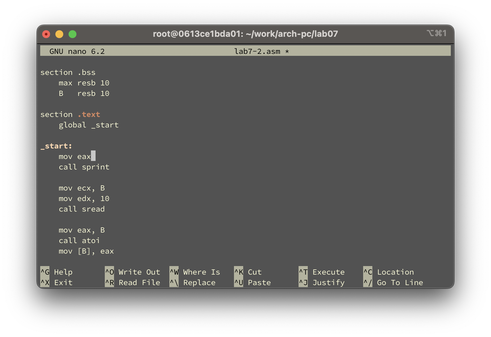{#fig-011 width=70%}

Выполним трансляцию с получением файла листинга (см. рис. @fig-012):

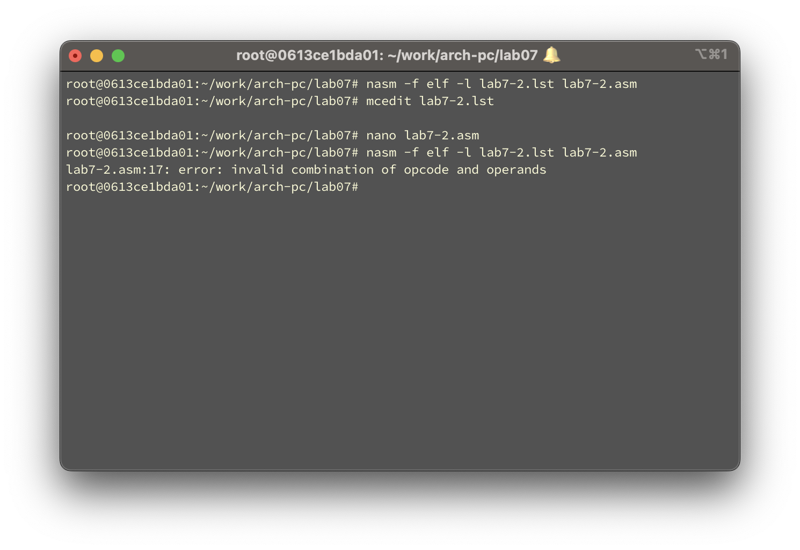{#fig-012 width=70%}

Из-за ошибки в строке `mov eax` NASM **не создал объектный файл `lab7-2.o`**. Создался только **файл листинга `lab7-2.lst`** , и сообщение об ошибке вывел в терминал.

В `lab7-2.lst` возле ошибочной инструкции появляется:
   * строка из `**************` вместо кода команды;
   * текст ошибки: `error: invalid combination of opcode and operands`

То есть в листинге прямо рядом с той строкой, где мы удалили операнд, NASM помечает её звёздочками и вставляет текст ошибки (см. рис. @fig-013).

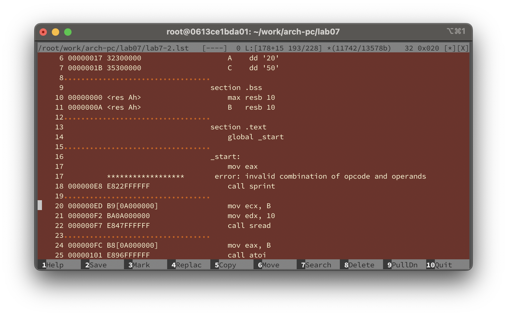{#fig-013 width=70%}

---

# Выполнение самостоятельной работы

1. Была разработана программа на языке ассемблера NASM для определения минимального значения среди трёх целочисленных переменных a, b и c, выбранных в соответствии с вариантом №15 таблицы 7.5 (значения: 32, 6, 54).

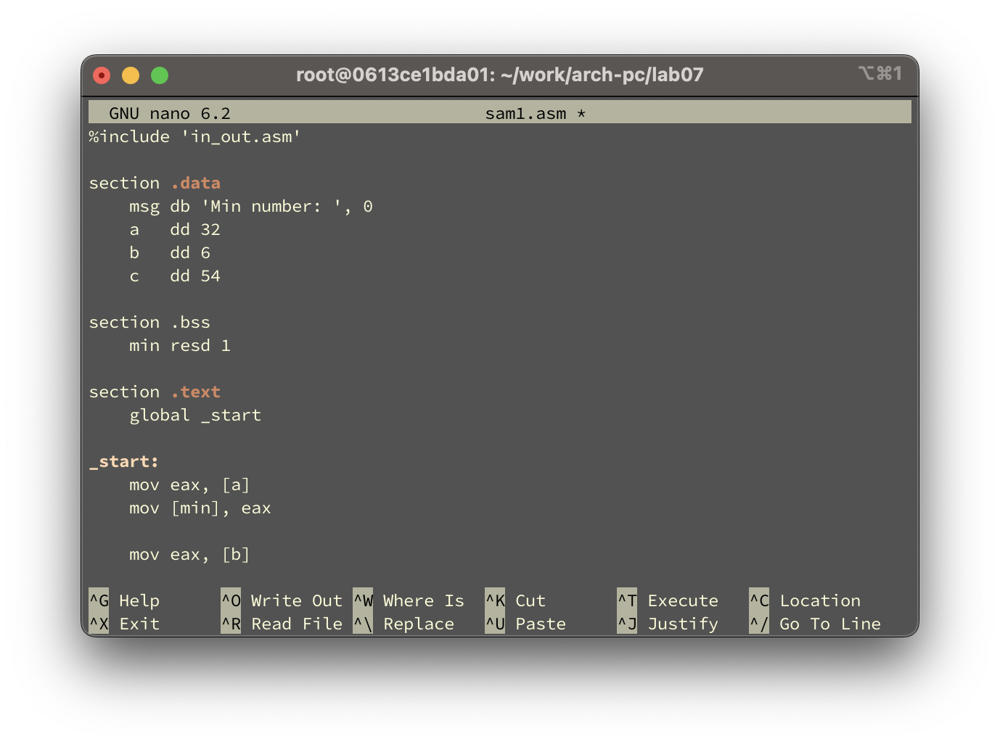{#fig-014 width=70%}

Программа выполняет сравнение значений и определяет наименьшее из них, выводя результат на экран (см. рис. @fig-015).

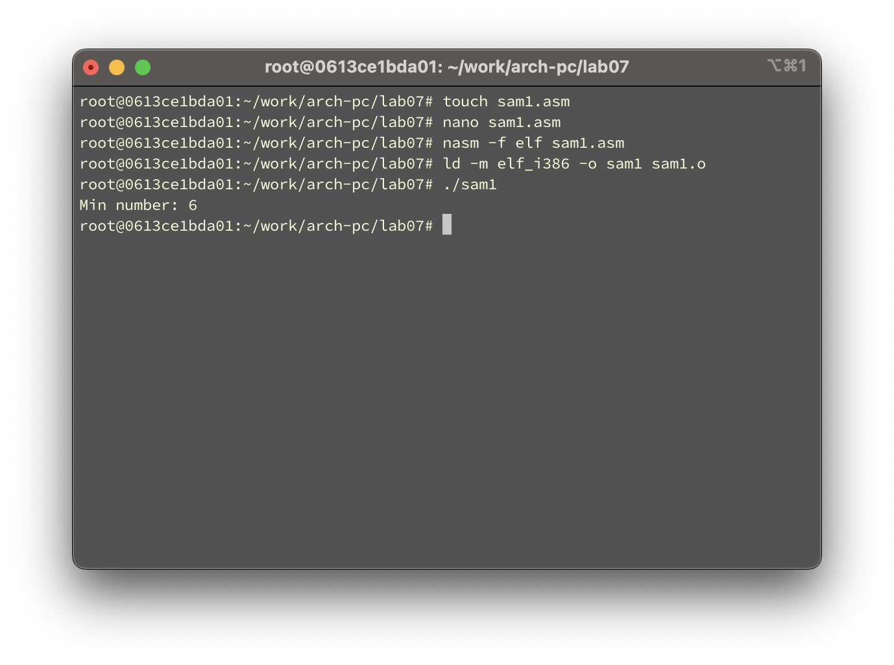{#fig-015 width=70%}

2. Была разработана программа на языке ассемблера NASM, вычисляющая значение функции f(x) по условию варианта №15 таблицы 7.6, где функция определяется как:
f(x) = a + 10 при x < a; f(x) = x + 10 при x ≥ a.

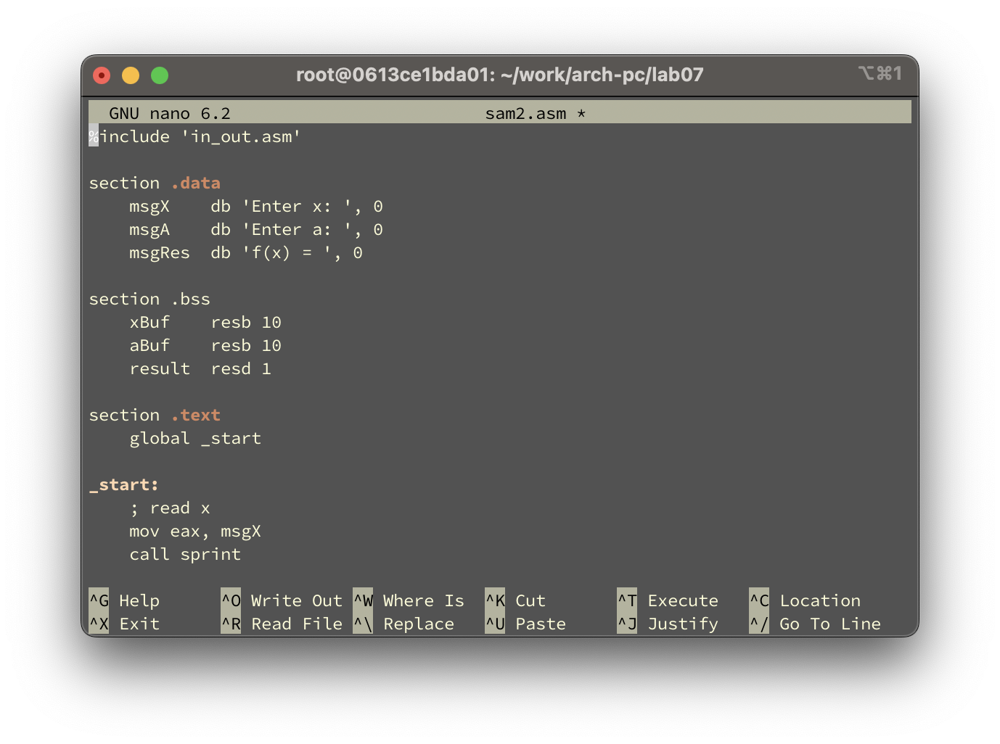{#fig-016 width=70%}

Программа запрашивает у пользователя значения x и a, производит вычисление функции и выводит результат.
Исполняемый файл был протестирован для значений из таблицы (2;3) и (4;2) и корректно возвращает 13 и 14 соответственно (см. рис. @fig-017).

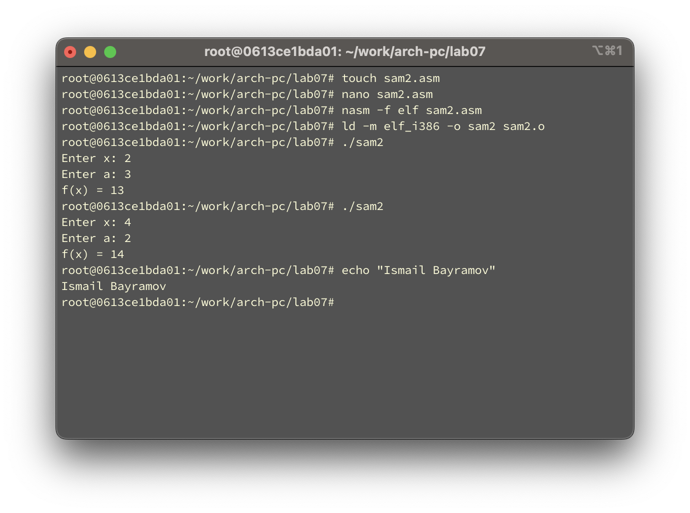{#fig-017 width=70%}

# Выводы

В ходе работы мы изучили команды условных и безусловных переходов и разобрали особенности их использования при создании программ на ассемблере. Мы приобрели практические навыки написания алгоритмов с разветвлениями, что позволило нам реализовать программы для поиска минимального значения и вычисления кусочной функции. Также мы познакомились с назначением и структурой файла листинга, что помогло нам лучше понять процесс трансляции и работу программы на уровне машинных инструкций.

