---
## Author
author:
  name: Байрамов Исмаил Мухандис оглы
  email: 1032253514@pfur.ru

## Title
title: "Отчёта по лабораторной работе №8. Программирование цикла. Обработка аргументов командной строки."
number-sections: true
license: "CC BY"
---

# Цель работы

Приобретение навыков написания программ с использованием циклов и обработкой аргументов командной строки.

# Выполнение лабораторной работы

1. Создадим каталог для программ лабораторной работы № 8, перейдем в него и создадим файл `lab8-1.asm`.
При реализации циклов в NASM с использованием инструкции loop необходимо помнить о том, что эта инструкция использует регистр ecx в качестве счетчика и на каждом шаге уменьшает его значение на единицу. В качестве примера рассмотрим программу, которая выводит значение регистра `ecx`. Внимательно изучим текст программы.
Введём в файл `lab8-1.asm` текст программы из листинга 8.1 (рис. @fig-001). Создадим исполняемый файл и проверим его работу (рис. @fig-002).

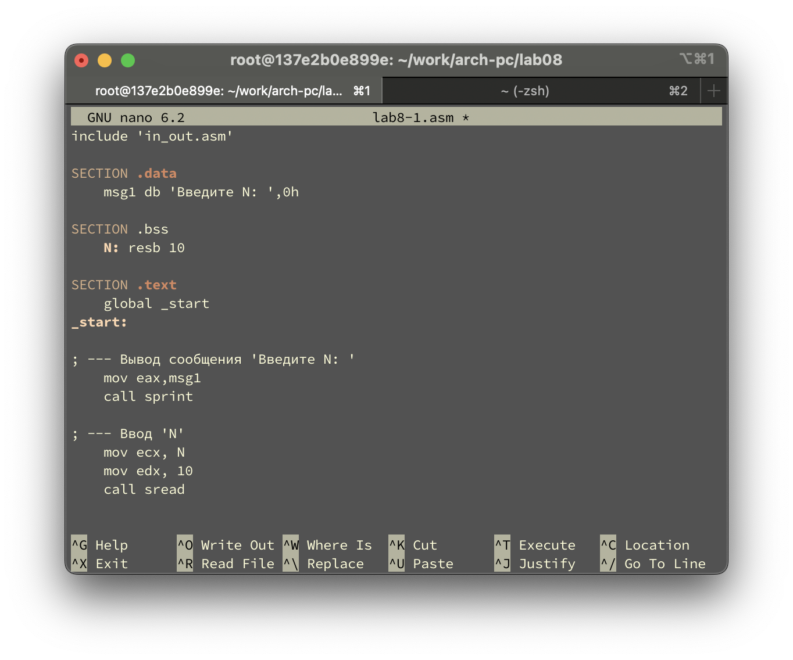{#fig-001 width=70%}

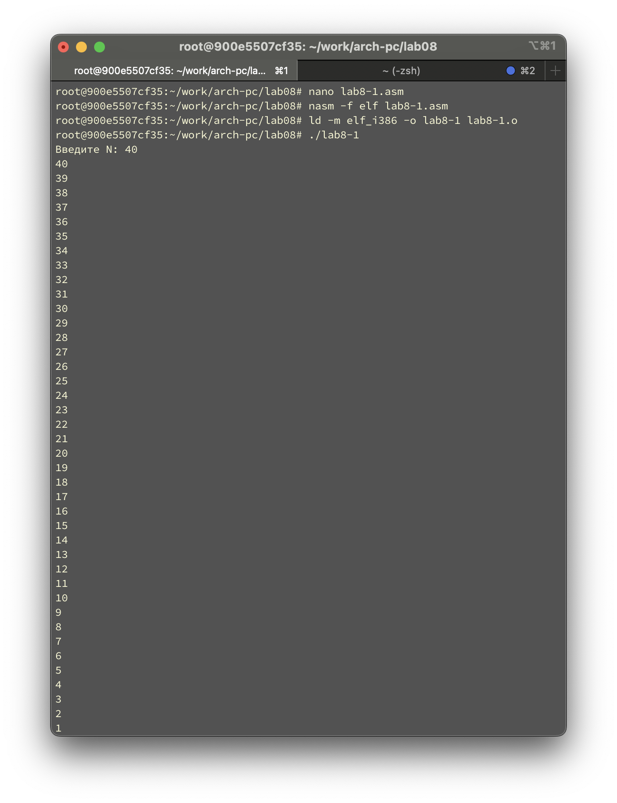{#fig-002 width=70%}

Данный пример показывает, что использование регистра ecx в теле цилка loop может привести к некорректной работе программы. Изменим текст программы добавив изменение значение регистра ecx в цикле (рис. @fig-003).

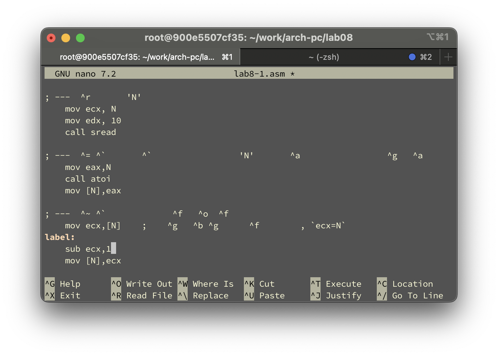{#fig-003 width=70%}

Создадим исполняемый файл и проверим его работу (рис. @fig-004).

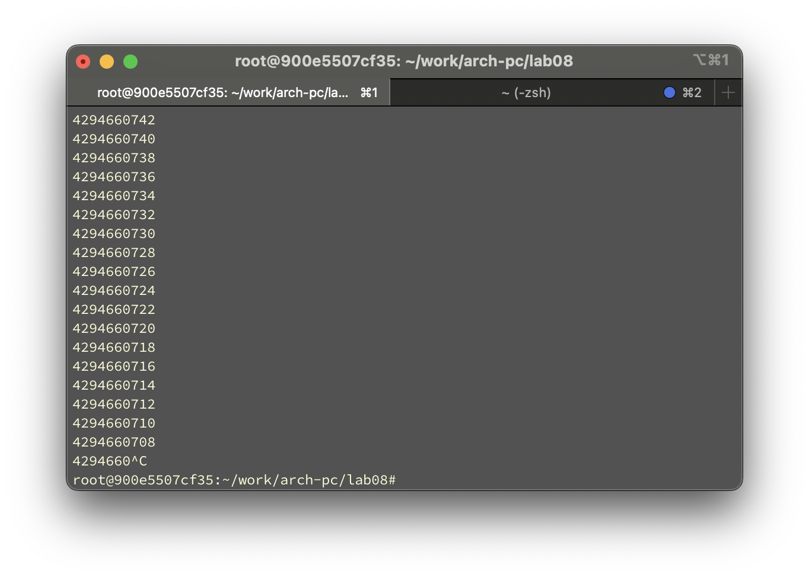{#fig-004 width=70%}

Какие значения принимает регистр ecx в цикле?
Ответ: Регистр в ecx в цикле принимает значения: 5 → 4 → 3 → 2 → 1 → 0 → 0xFFFFFFFF...
Соответствует ли число проходов цикла значению 𝑁 введенному с клавиатуры? 
Ответ: Нет, число проходов цикла не соответствует значению N.

Для использования регистра `ecx` в цикле и сохранения корректности работы программы можно использовать стек. Внесём изменения в текст программы, добавив команды `push` и `pop` (добавления в стек и извлечения из стека) для сохранения значения счетчика цикла `loop`. Далее создадим исполняемый файл и проверим его работу (рис. @fig-005).

{#fig-005 width=70%}

Соответствует ли в данном случае число проходов цикла значению 𝑁 введенному с клавиатуры? 
Ответ: Да, число проходов цикла полностью соответствует значению N.

2. Создадим файл `lab8-2.asm` в каталоге `~/work/arch-pc/lab08` и введём в него текст программы из листинга 8.2 (рис. @fig-006).

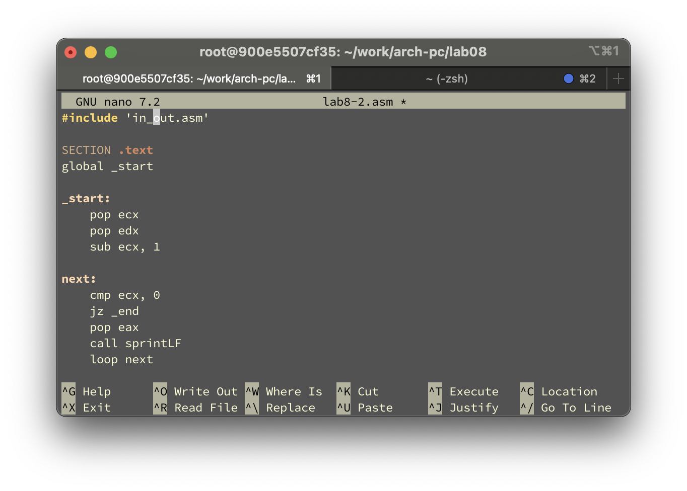{#fig-006 width=70%}

Создадим исполняемый файл и запустим его, указав аргументы (рис. @fig-007).

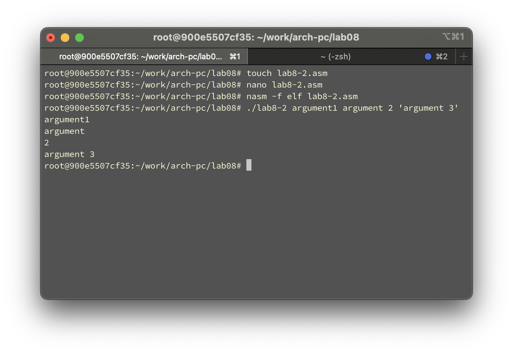{#fig-007 width=70%}

Сколько аргументов было обработано программой?
Ответ: Программа обработала 4 аргумента.

Рассмотрим еще один пример программы которая выводит сумму чисел, которые передаются в программу как аргументы. Создадим файл `lab8-3.asm` в каталоге `~/work/archpc/lab08` и введём в него текст программы из листинга 8.3 (рис. @fig-008).

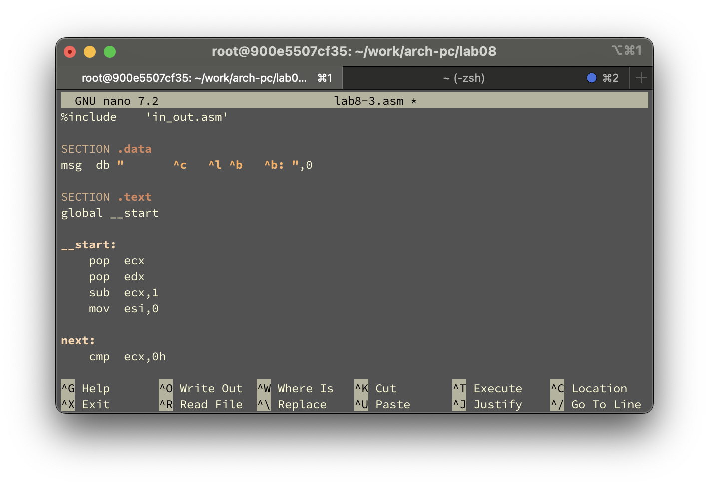{#fig-008 width=70%}

Создадим исполняемый файл и запустим его, указав аргументы (рис. @fig-009).

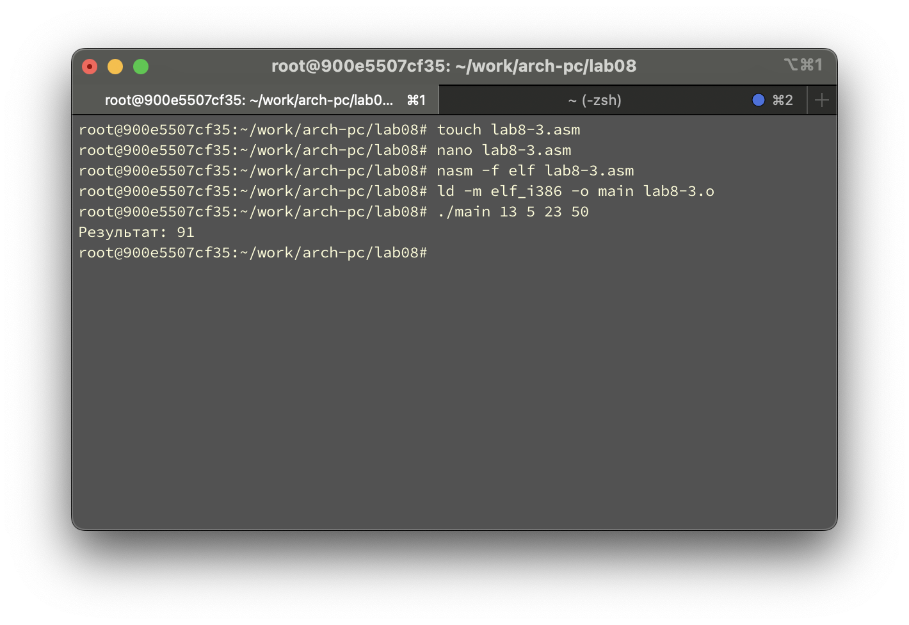{#fig-009 width=70%}

Изменим текст программы из листинга 8.3 для вычисления произведения аргументов
командной строки (рис. @fig-010).

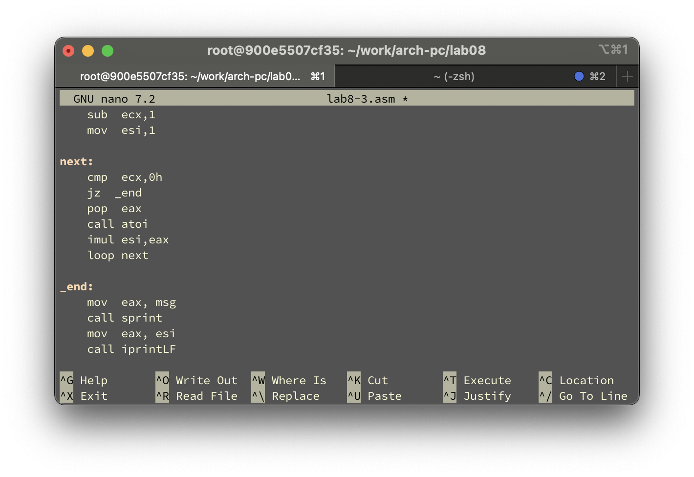{#fig-010 width=70%}

Создадим исполняемый файл и проверим его, указав аргументы (рис. @fig-011).

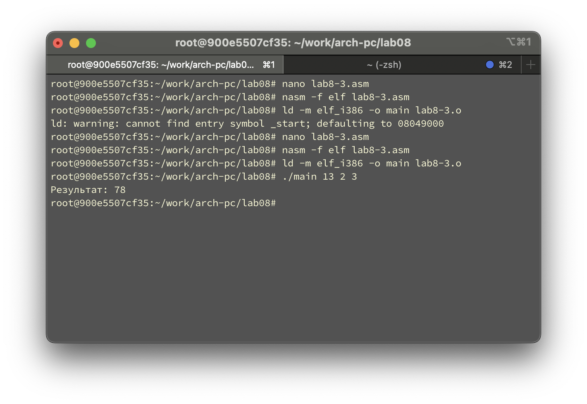{#fig-011 width=70%}

---

# Выполнение самостоятельной работы

1. Была разработана программа на языке ассемблера NASM для вычисления суммы значений функции f(x) = 6x + 13 для заданных аргументов командной строки x₁, x₂, ..., xₙ. Программа выводит вид используемой функции и общую сумму вычисленных значений.

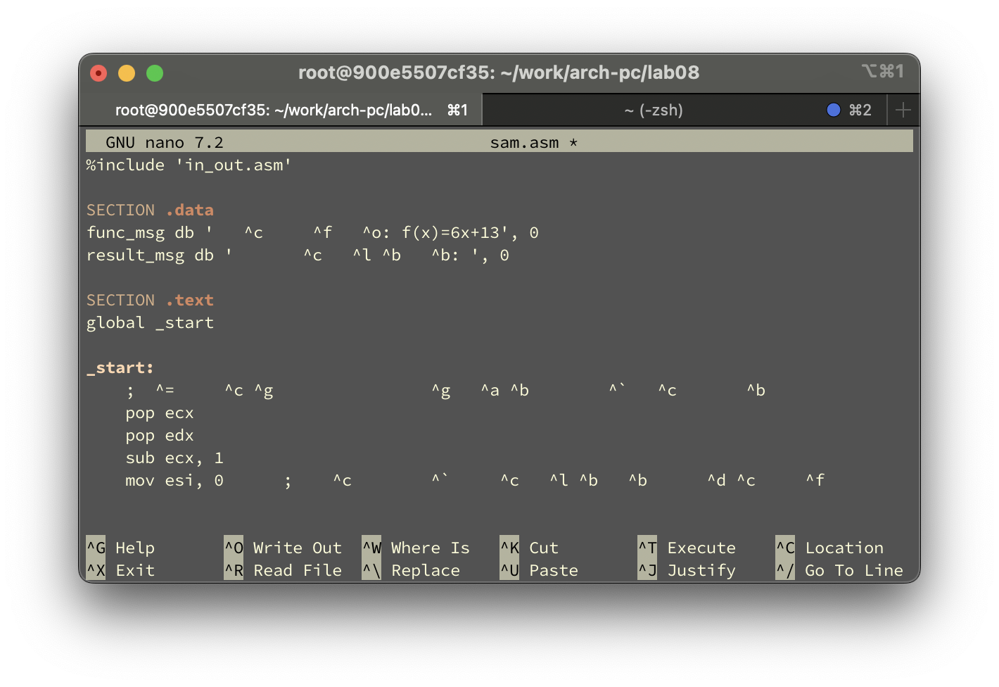{#fig-012 width=70%}

Программа извлекает аргументы командной строки, преобразует их в числа и для каждого значения вычисляет функцию f(x) = 6x + 13, накапливая сумму результатов. Затем выводится информация о используемой функции и полученная итоговая сумма (см. рис. @fig-013).

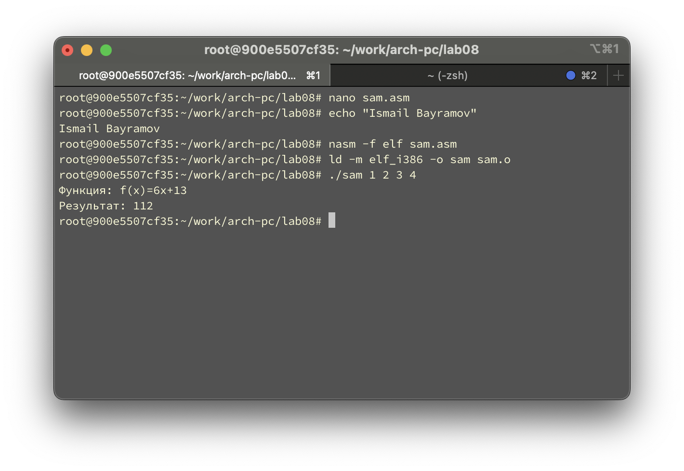{#fig-013 width=70%}

# Выводы

В ходе выполнения работы были успешно приобретены навыки написания программ на ассемблере с использованием циклов и обработки аргументов командной строки. Разработанная программа демонстрирует умение работать со стеком, организовывать циклические вычисления и преобразовывать данные между различными форматами представления.

