---
## Author
author:
  name: Байрамов Исмаил Мухандис оглы
  email: 1032253514@pfur.ru

## Title
title: "Отчёта по лабораторной работе №9. Понятие подпрограммы. Отладчик GDB."
number-sections: true
license: "CC BY"
---

# Цель работы

Приобретение навыков написания программ с использованием подпрограмм. Знакомство с методами отладки при помощи GDB и его основными возможностями.

# Выполнение лабораторной работы

## Реализация подпрограмм в NASM

1. Создадим каталог для программ лабораторной работы № 9, перейдем в него и создадим файл `lab09-1.asm`.

2. В качестве примера рассмотрим программу вычисления арифметического выражения `𝑓(𝑥) = 2𝑥 + 7` с помощью подпрограммы `_calcul`. В данном примере `𝑥` вводится с клавиатуры, а само выражение вычисляется в подпрограмме. Инструкция ret является последней в подпрограмме и ее исполнение приводит к возвращению в основную программу к инструкции, следующей за инструкцией `call`, которая вызвала данную подпрограмму.
Последние строки программы реализую вывод сообщения (`call sprint`), результата вычисления (`call iprintLF`) и завершение программы (`call quit`). Введем в файл `lab09-1.asm` текст программы из листинга 9.1. Создадим исполняемый файл и проверим его работу.

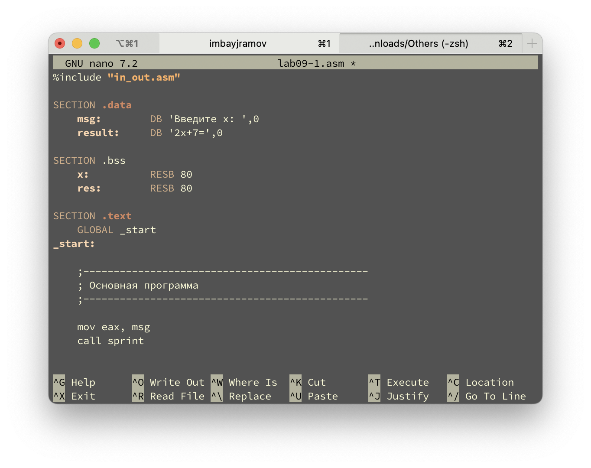{#fig-001 width=70%}

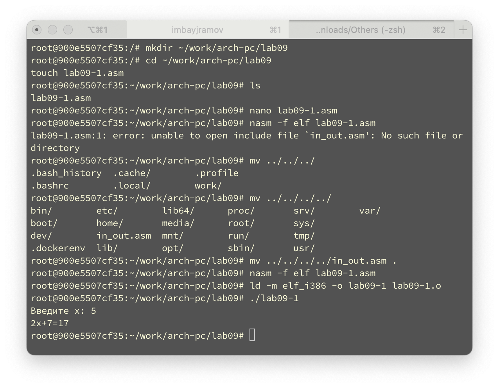{#fig-002 width=70%}

Изменим текст программы, добавив подпрограмму `_subcalcul` в подпрограмму `_calcul`,
для вычисления выражения `𝑓(𝑔(𝑥))`, где `𝑥` вводится с клавиатуры, `𝑓(𝑥) = 2𝑥 + 7, 𝑔(𝑥) =
3𝑥 − 1`. Т.е. `𝑥` передается в подпрограмму _calcul из нее в подпрограмму `_subcalcul`, где
вычисляется выражение `𝑔(𝑥)`, результат возвращается в `_calcul` и вычисляется выражение
`𝑓(𝑔(𝑥))` (см. рис. @fig-003). Результат возвращается в основную программу для вывода результата на экран.

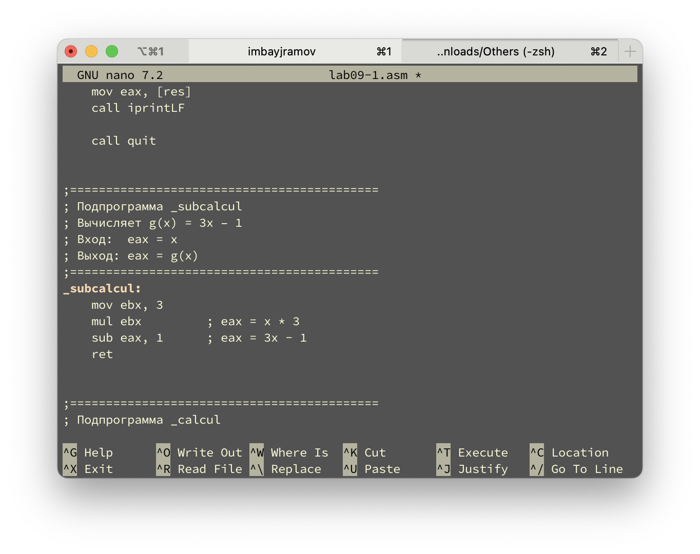{#fig-003 width=70%}

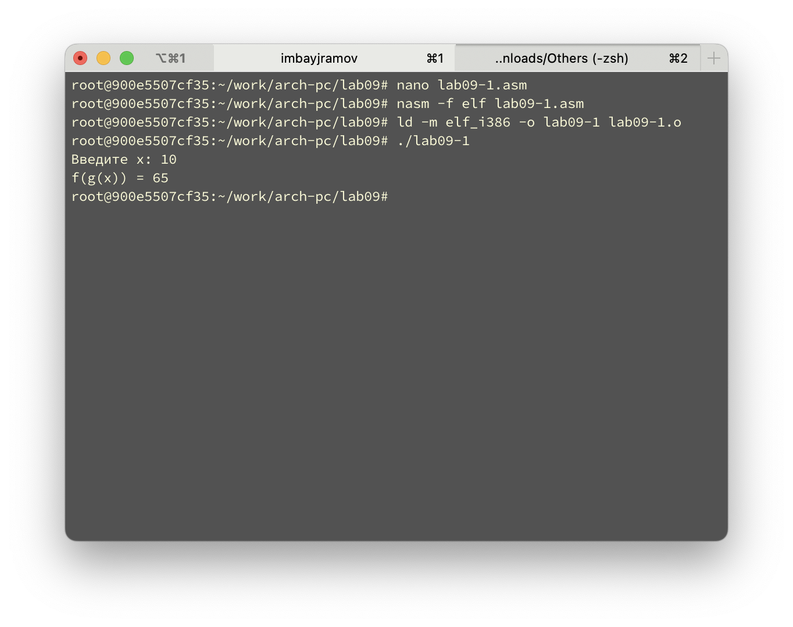{#fig-004 width=70%}

## Отладка программам с помощью GDB

Создадим файл `lab09-2.asm` в каталоге `~/work/arch-pc/lab09` и введём в него текст программы из листинга 9.2 (рис. @fig-005).

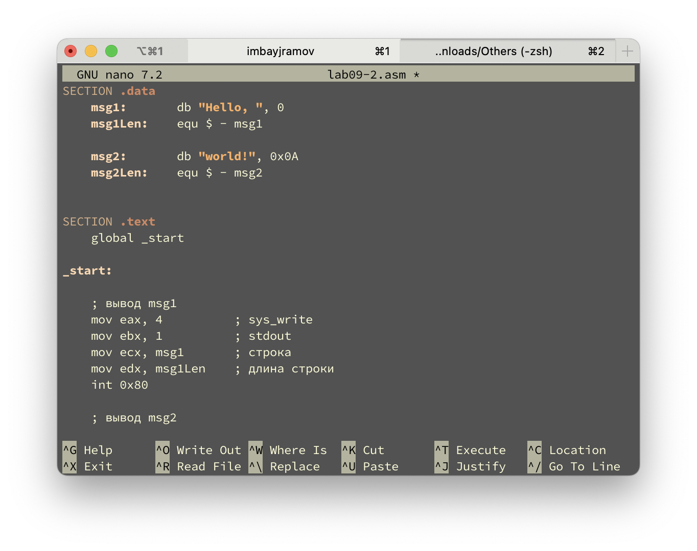{#fig-005 width=70%}

Получим исполняемый файл.Для работы с GDB в исполняемый файл необходимо добавить отладочную информацию, для этого трансляцию программ необходимо проводить с ключом ‘-g’. Далее загрузим исполняемый файл в отладчик `gdb` (рис. @fig-006).

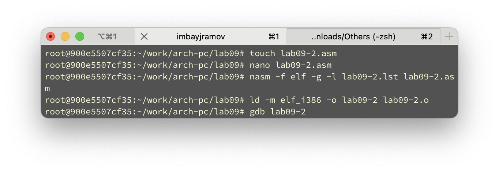{#fig-006 width=70%}

Проверим работу программы, запустив ее в оболочке GDB с помощью команды `run` (сокращённо `r`):

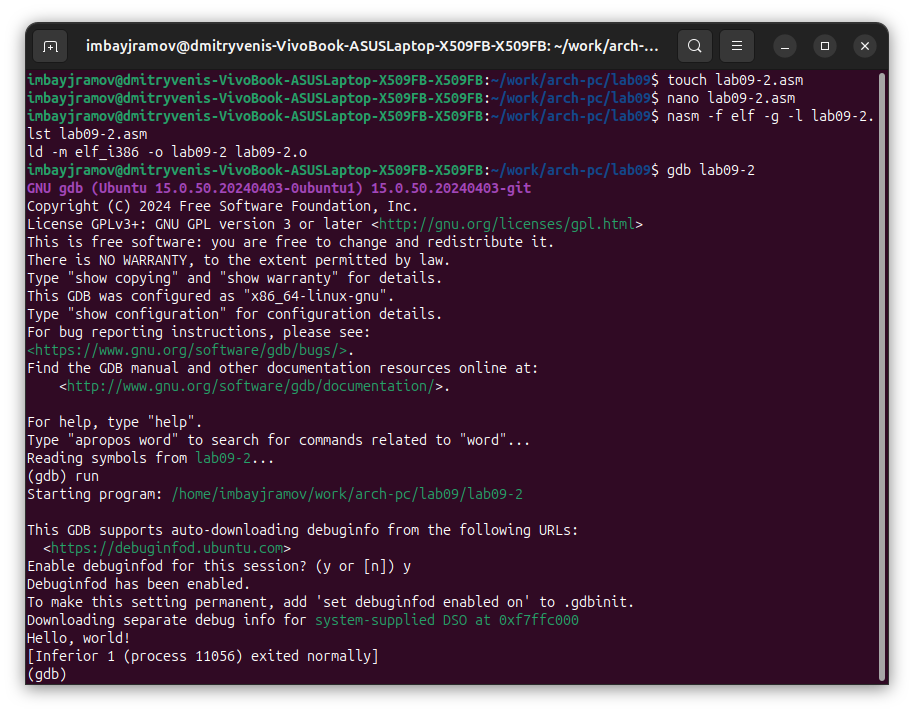{#fig-007 width=70%}

Для более подробного анализа программы установим брейкпоинт на метку `_start`, с которой начинается выполнение любой ассемблерной программы, и запустим её:

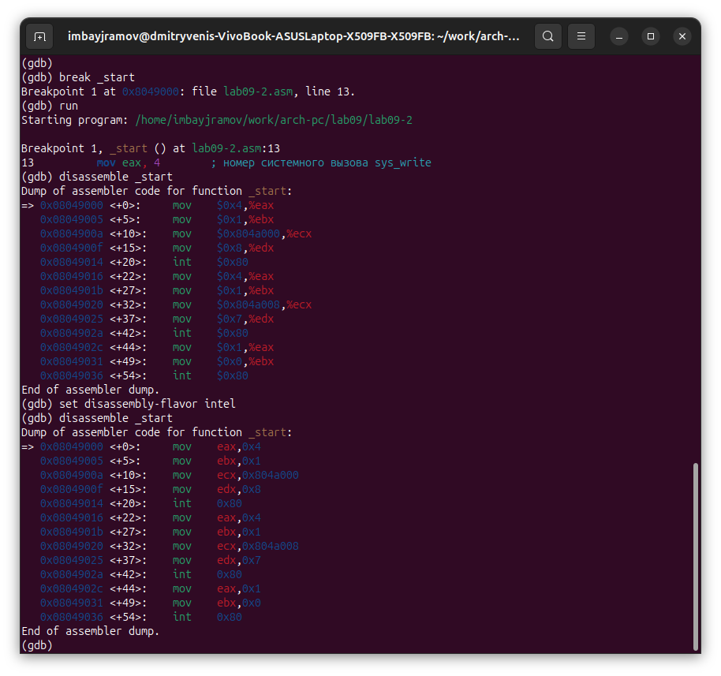{#fig-008 width=70%}

Посмотрим дисассимилированный код программы с помощью команды `disassemble` начиная с метки `_start` и переключимся на отображение команд с Intel’овским синтаксисом, введя команду `set
disassembly-flavor intel`.

Перечислим различия отображения синтаксиса машинных команд в режимах ATT и Intel. Включим режим псевдографики для более удобного анализа программы (рис. @fig-009):

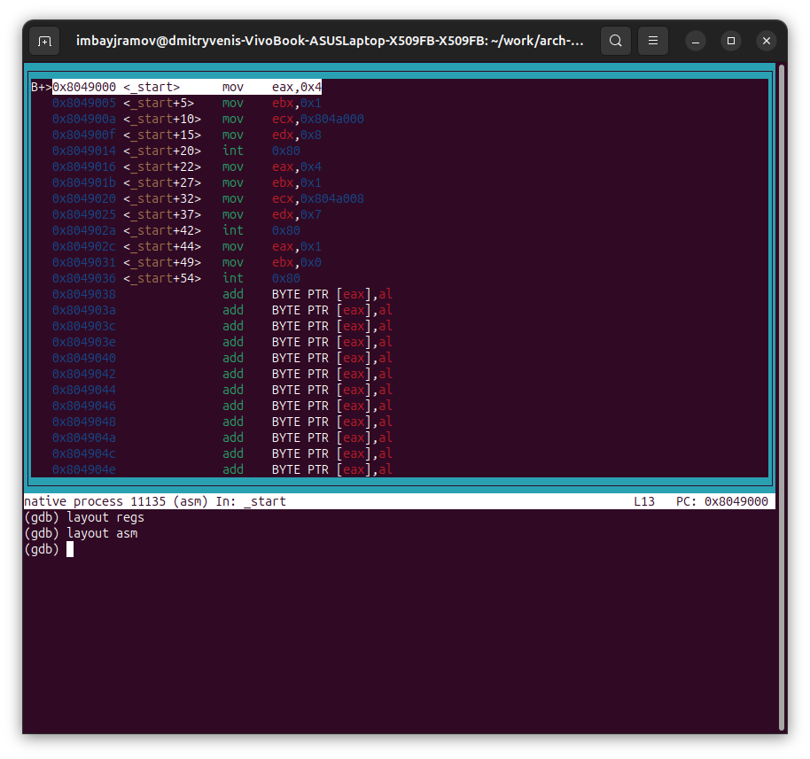{#fig-009 width=70%}

Различия отображения синтаксиса машинных команд в режимах AT&T и Intel:
Ответ: Синтаксис AT&T отличается тем, что регистры пишутся с процентом, числа — со знаком доллара, порядок операндов обратный по сравнению с Intel, адреса записываются в круглых скобках, а размер операций указывается буквенными суффиксами.
В Intel регистры пишутся без символов, числа — напрямую, порядок операндов прямой, адреса задаются в квадратных скобках, а размеры описываются словами вроде BYTE или DWORD.

В этом режиме есть три окна:
• В верхней части видны названия регистров и их текущие значения;
• В средней части виден результат дисассимилирования программы;
• Нижняя часть доступна для ввода команд.

### Добавление точек останова

Установить точку останова можно командой break (кратко `b`). Типичный аргумент этой команды — место установки. Его можно задать или как номер строки программы (имеет смысл, если есть исходный файл, а программа компилировалась с информацией об отладке), или как имя метки, или как адрес. Чтобы не было путаницы с номерами, перед адресом ставится «звёздочка»:
На предыдущих шагах была установлена точка останова по имени метки (`_start`). Проверим это с помощью команды `info breakpoints` (кратко `i b`) (рис. @fig-010).

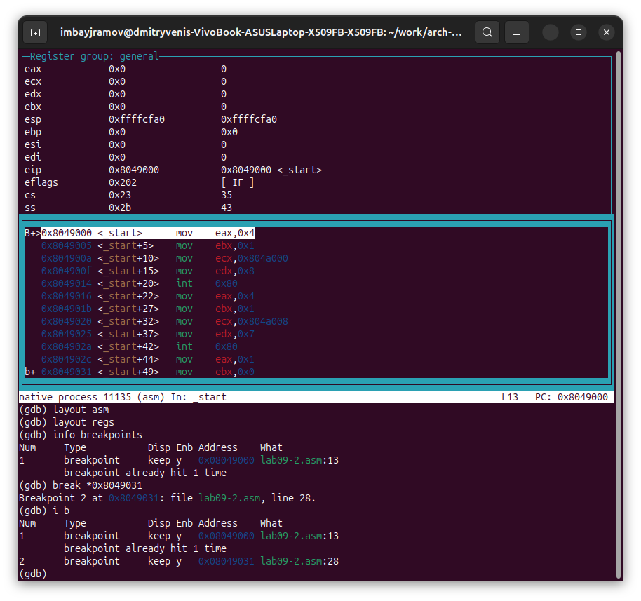{#fig-010 width=70%}

Установим еще одну точку останова по адресу инструкции. Адрес инструкции можно увидеть в средней части экрана в левом столбце соответствующей инструкции. Определим адрес предпоследней инструкции (mov ebx,0x0) и установим точку останова (рис. @fig-010) и посмотрим информацию о всех установленных точках останова.

### Работа с данными программы в GDB

Отладчик может показывать содержимое ячеек памяти и регистров, а при необходимости позволяет вручную изменять значения регистров и переменных.
Выполним 5 инструкций с помощью команды stepi и заметим, что после выполнения этих пяти инструкций изменяются значения регистров EAX, EBX, ECX, EDX, а также постоянно меняется EIP (счётчик команд).

Посмотреть содержимое регистров также можно с помощью команды `info registers` (или `i r`).
Для отображения содержимого памяти можно использовать команду `x <адрес>`, которая выдаёт содержимое ячейки памяти по указанному адресу. Формат, в котором выводятся данные, можно задать после имени команды через косую черту: `x/NFU <адрес>`.
С помощью команды `x &<имя переменной>` также можно посмотреть содержимое переменной.
Посмотрим значение переменной msg1 по имени:

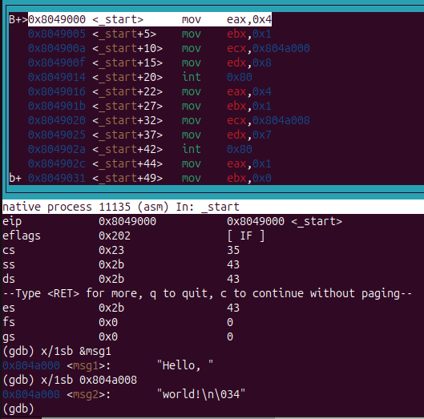{#fig-011 width=70%}

Также посмотрим значение переменной `msg2` по адресу. Адрес переменной можно определить по дизассемблированной инструкции. Посмотрим инструкцию `mov ecx,msg2`, которая записывает в регистр ecx адрес перемененной `msg2`.

Изменить значение для регистра или ячейки памяти можно с помощью команды `set`, задав ей в качестве аргумента имя регистра или адрес. При этом перед именем регистра ставится префикс `$`, а перед адресом нужно указать в фигурных скобках тип данных (размер сохраняемого значения; в качестве типа данных можно использовать типы языка Си).
Изменим первый символ переменной `msg1` (рис. @fig-012).

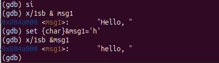{#fig-012 width=70%}

Заменим любой символ во второй переменной `msg2`:

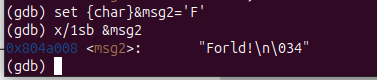{#fig-013 width=70%}

Чтобы посмотреть значения регистров используется команда `print /F <val>` (перед именем регистра обязательно ставится префикс `$`). Выведем в различных форматах (в шестнадцатеричном формате, в двоичном формате и в символьном виде) значение регистра edx:

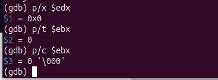{#fig-014 width=70%}

С помощью команды `set` изменим значение регистра `ebx` (рис. @fig-015).

С помощью команды `set` изменим значение регистра `ebx`. 

Объясните разницу вывода команд p/s $ebx.
Ответ: Команда p выводит значение как обычное число, а p/s интерпретирует значение как строку по адресу, который хранится в регистре. В данном случае в ebx = 2, и по адресу 0x00000002 нет строки, поэтому GDB просто выводит число 2.

Завершим выполнение программы с помощью команды `continue` (сокращенно `c`) или `stepi` (сокращенно `si`) и выйдем из GDB с помощью команды `quit` (сокращенно `q`).

### Обработка аргументов командной строки в GDB

Скопируем файл `lab8-2.asm`, созданный при выполнении лабораторной работы №8, с программой выводящей на экран аргументы командной строки в файл с именем `lab09-3.asm` и создадим исполняемый файл (рис. @fig-016).

Для загрузки в `gdb` программы с аргументами необходимо использовать ключ `--args`. Загрузим исполняемый файл в отладчик, указав аргументы:

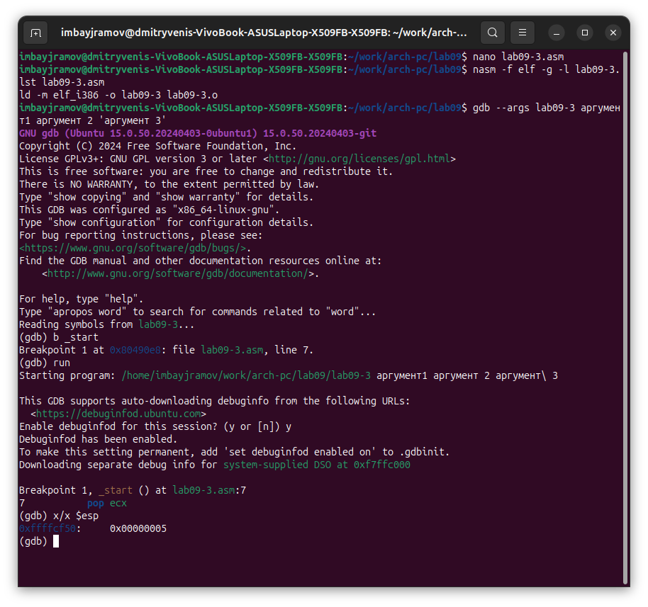{#fig-016 width=70%}

Как отмечалось в предыдущей лабораторной работе, при запуске программы аргументы командной строки загружаются в стек. Исследуем расположение аргументов командной строки в стеке после запуска программы с помощью gdb. Для начала установим точку останова перед первой инструкцией в программе и запустим ее (см. рис. @fig-016).

Как видно, число аргументов равно 5 – это имя программы lab09-3 и непосредственно аргументы: аргумент1, аргумент2 и 'аргумент 3'.

Посмотрим остальные позиции стека – по адесу `[esp+4]` располагается адрес в памяти
где находится имя программы, по адесу `[esp+8]` храниться адрес первого аргумента, по
аресу `[esp+12]` – второго и т.д. (рис. @fig-017).

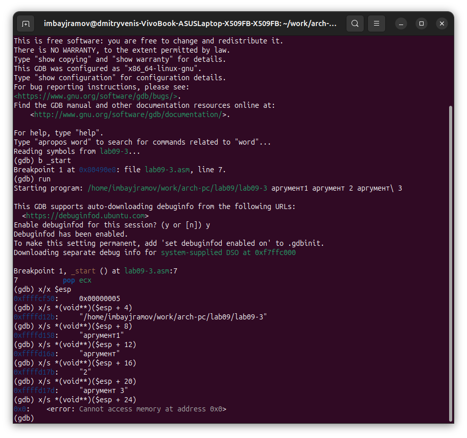{#fig-017 width=70%}

Шаг равен 4 байта, потому что это 32-битная программа: каждый указатель (адрес аргумента) занимает 4 байта. В стеке подряд лежат указатели `argv[0]`, `argv[1]`, ..., поэтому они находятся по адресам `[esp+4]`, `[esp+8]`, `[esp+12]`, ... — каждая следующая ячейка смещена ровно на размер одного указателя, то есть на 4 байта.

---

# Выполнение самостоятельной работы

1. Я вынес вычисление функции `f(x) = 6x + 13` в отдельную подпрограмму `calculate_function`. Вместо вычислений прямо в цикле, теперь используется команда `call calculate_function`, что делает код более модульным и читаемым. Подпрограмма принимает x через регистр `eax`, сохраняет контекст (регистр `ebx`), выполняет вычисления и возвращает результат в `eax`. Это позволяет повторно использовать эту логику в других частях программы и упрощает модификацию формулы функции в будущем.

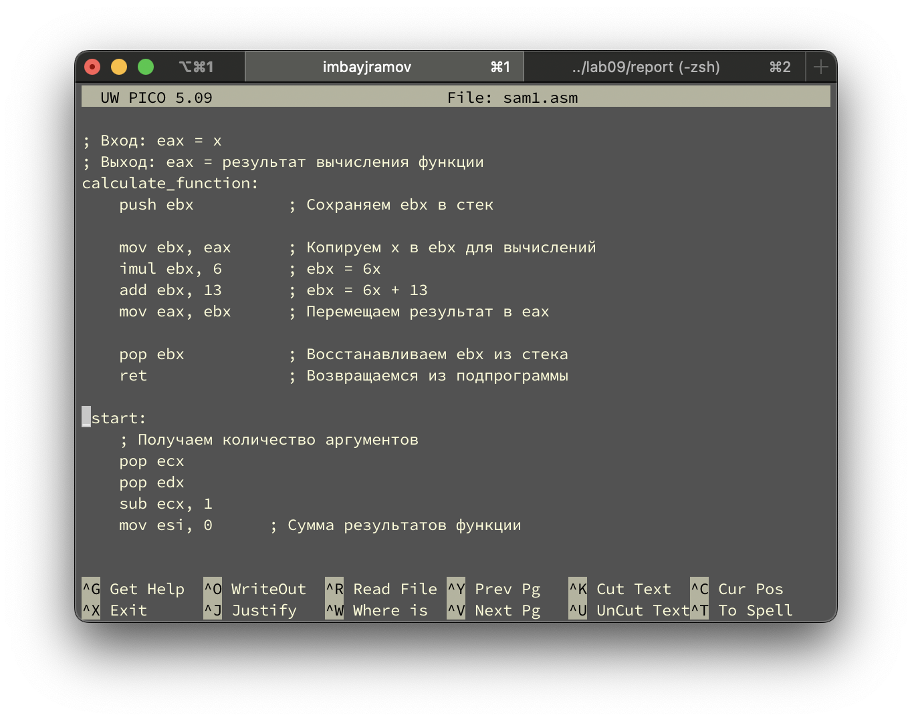{#fig-018 width=70%}

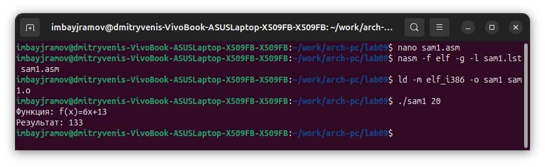{#fig-019 width=70%}

2. Я запустил программу под GDB, установил точку остановки в начале и начал выполнять инструкции командой si, наблюдая за изменением регистров EBX, EAX и ECX. Так я увидел, что после операции умножения результат попадал в EAX, но дальнейшие вычисления продолжали использовать EBX, из-за чего выражение считалось неверно. Я переписал участок кода так, чтобы все промежуточные значения сохранялись в EAX, заново собрал программу и проверил её запуском. После исправления результат стал корректным — 25.

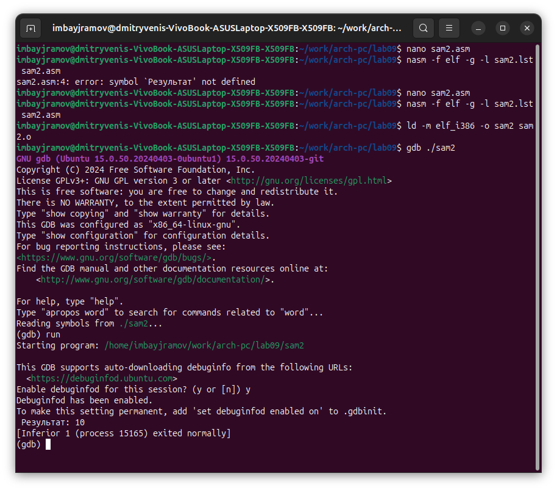{#fig-019 width=70%}

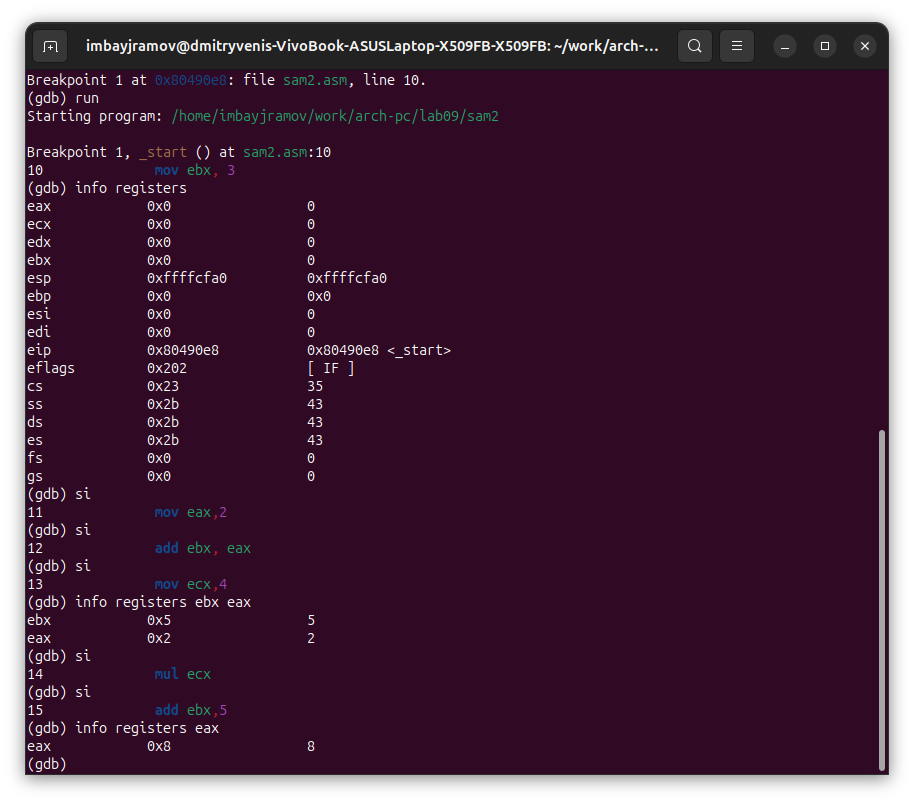{#fig-019 width=70%}

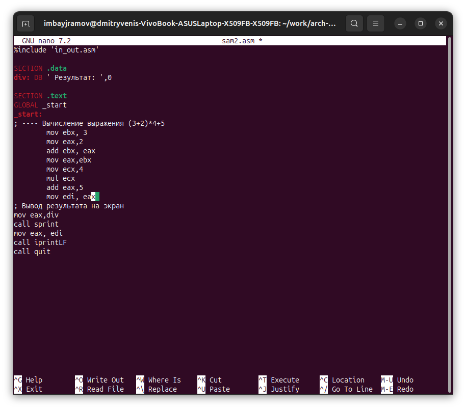{#fig-019 width=70%}

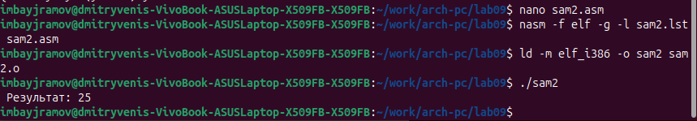{#fig-019 width=70%}

# Выводы

В ходе выполнения работы были приобретены навыки написания программ с использованием подпрограмм. Мы ознакомились с методами отладки при помощи GDB и его основными возможностями.

