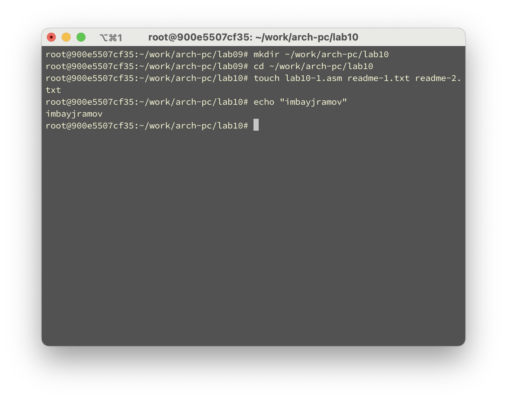
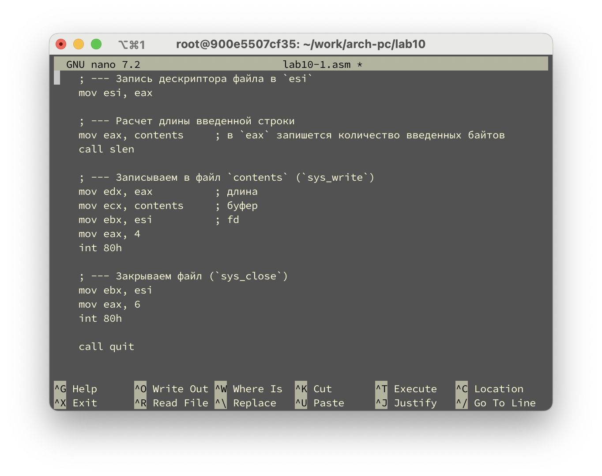
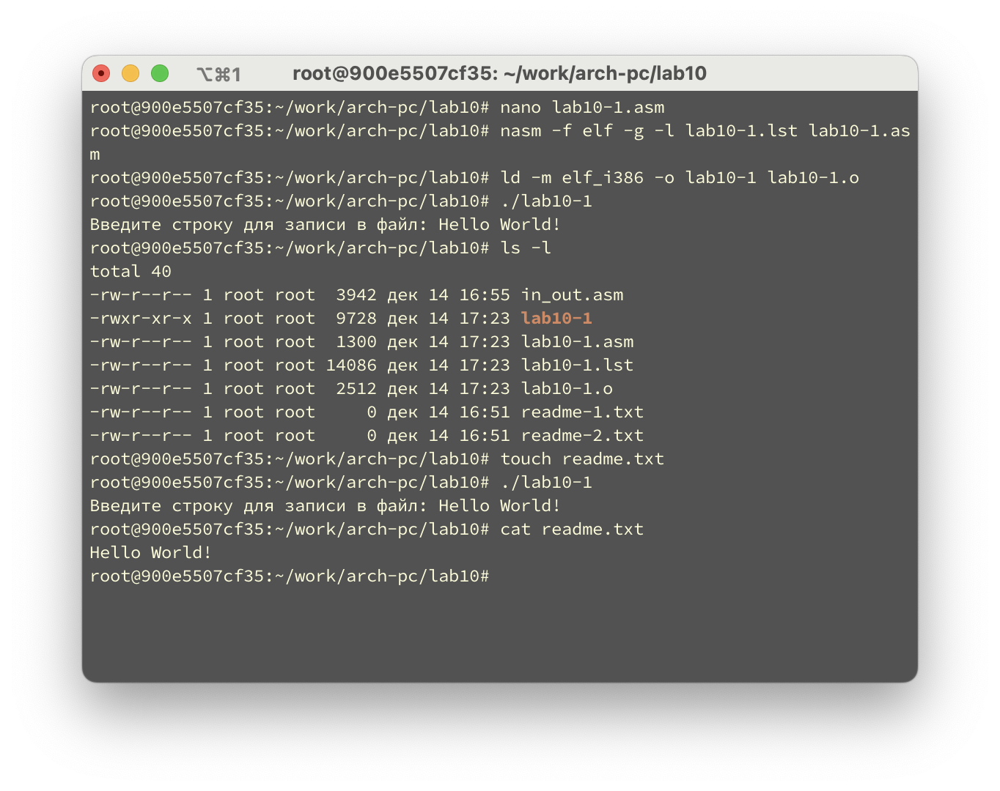
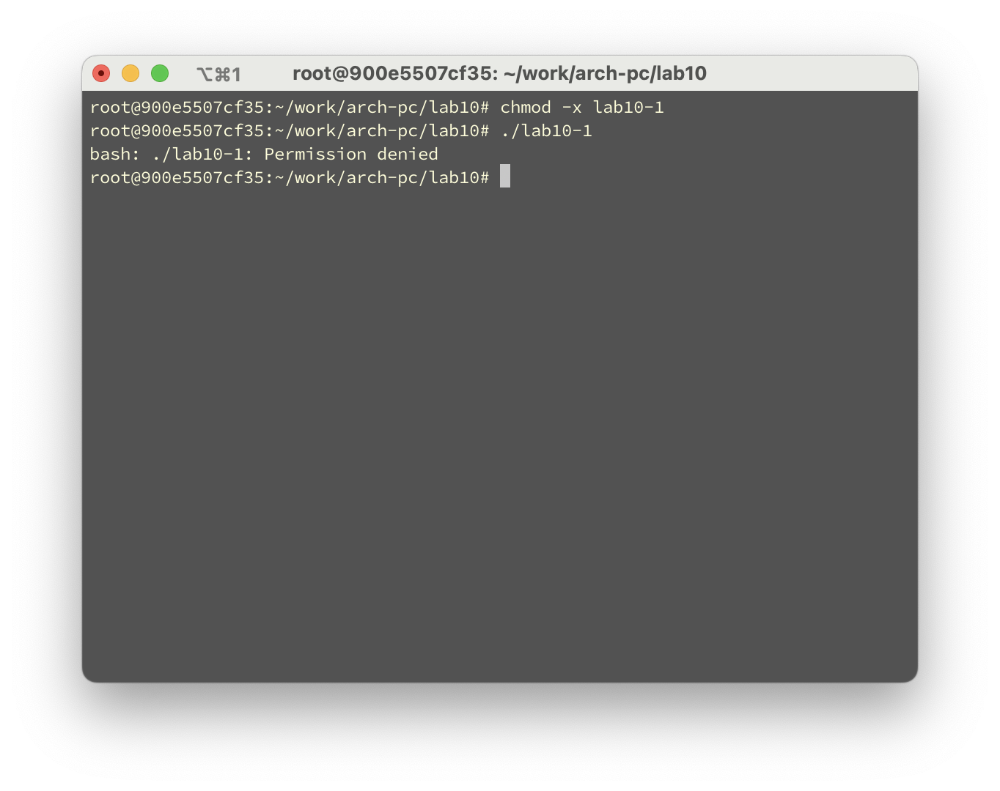
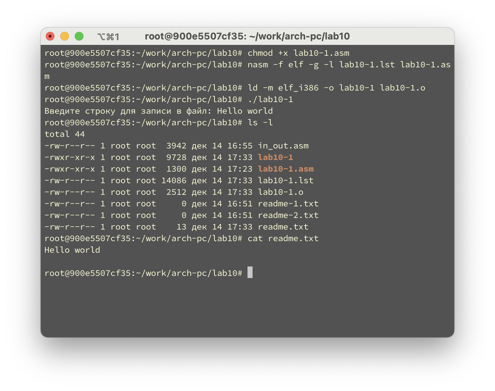
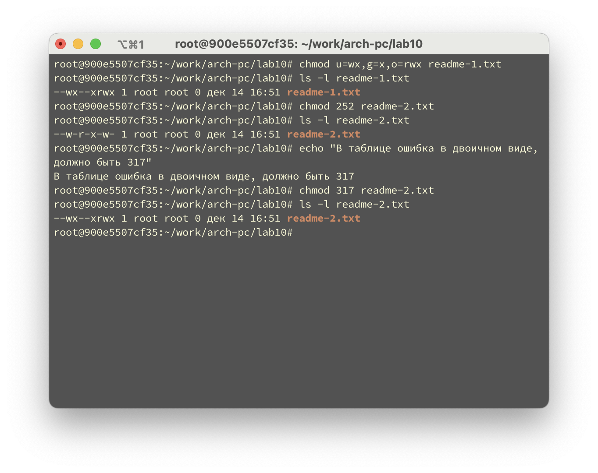
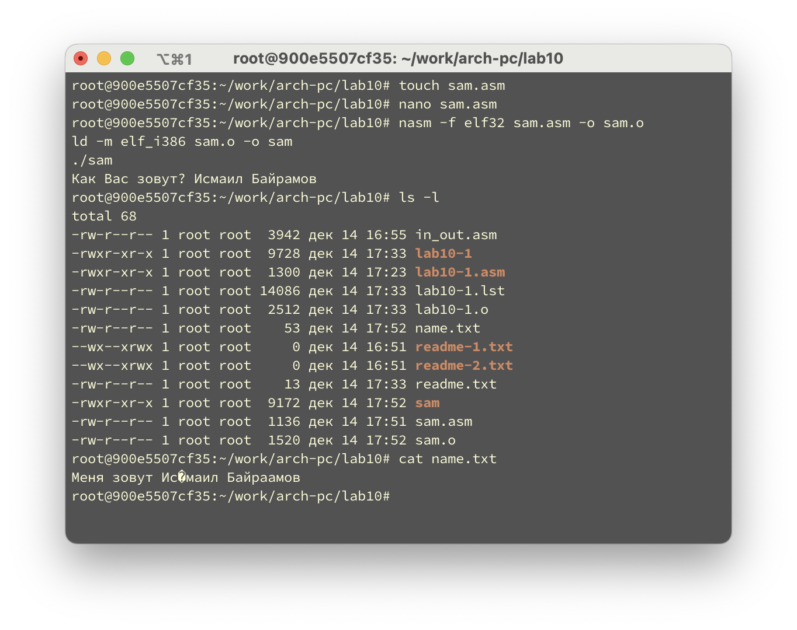

---
## Author
author:
  name: Байрамов Исмаил Мухандис оглы
  email: 1032253514@pfur.ru

## Title
title: "Отчёта по лабораторной работе №10. Работа с файлами средствами Nasm."
number-sections: true
license: "CC BY"
---

# Цель работы

Приобретение навыков написания программ для работы с файлами.

# Выполнение лабораторной работы

1. Создадим каталог для программ лабораторной работы № 10, перейдем в него и создадим файлы `lab10-1.asm`,`readme-1.txt` и `readme-2.txt`.

{#fig-001 width=70%}

2. Введем в файл `lab10-1.asm` текст программы из листинга 10.1 (Программа записи в файл сообщения). 

{#fig-002 width=70%}

Далее создадим исполняемый файл и проверим его работу.

{#fig-003 width=70%}

Программа работает корректно, но перед запуском нужно создать файл `readme.txt`

3. С помощью команды `chmod` изменим права доступа к исполняемому файлу `lab10-1`, запретив его выполнение. Попытаемся выполнить файл:

{#fig-004 width=70%}

Операционная система выдает сообщение об ошибке `Permission denied`. Это происходит потому, что для выполнения файла в Linux необходимо наличие права `x` (`execute`). При его отсутствии ядро операционной системы запрещает запуск файла, даже если файл существует и является исполняемым.

4. С помощью команды `chmod` изменим права доступа к файлу `lab10-1.asm` с исходным текстом программы, добавив права на исполнение. Попытаемся выполнить файл:

{#fig-005 width=70%}

В результате выполнение завершилось ошибкой (Exec format error или аналогичной). Это объясняется тем, что файл `lab10-1.asm` является текстовым файлом с исходным кодом на ассемблере, а не исполняемым бинарным файлом или скриптом. Наличие права на выполнение само по себе не делает файл программой — операционная система не может выполнить исходный текст без предварительной компиляции и компоновки.

5. В соответствии с вариантом в таблице 10.4 предоставим права доступа к файлу `readme1.txt` представленные в символьном виде, а для файла `readme-2.txt` – в двочном виде. Проверим правильность выполнения с помощью команды `ls -l`.

{#fig-006 width=70%}

---

# Выполнение самостоятельной работы

Я разработал программу, использующую системные вызовы через прерывание int 80h. В начале программы в сегменте данных были объявлены строки с приглашением пользователю «Как Вас зовут?», текст для записи в файл «Меня зовут » и имя создаваемого файла name.txt, а в сегменте .bss был выделен буфер для хранения строки, вводимой с клавиатуры. После старта программы выполняется вывод приглашения на экран с помощью подпрограммы вывода строки, затем осуществляется ввод фамилии и имени пользователя с клавиатуры в заранее выделенный буфер. Далее с помощью системного вызова sys_open файл name.txt создаётся (или открывается, если он уже существует) с правами доступа на чтение и запись, при этом старое содержимое файла очищается. Полученный файловый дескриптор сохраняется в регистре, после чего выполняются два системных вызова sys_write: сначала в файл записывается строка «Меня зовут », затем — строка, введённая пользователем, длина которой вычисляется с помощью подпрограммы определения длины строки. По завершении записи файл закрывается системным вызовом sys_close, и программа корректно завершает работу. Правильность выполнения программы проверяется с помощью команд ls для контроля наличия файла и cat для просмотра его содержимого.

{#fig-007 width=70%}

# Выводы

В ходе выполнения лабораторной работы я приобрел навыки написания программ для работы с файлами и научился создавать и редактировать их средствами Nasm.